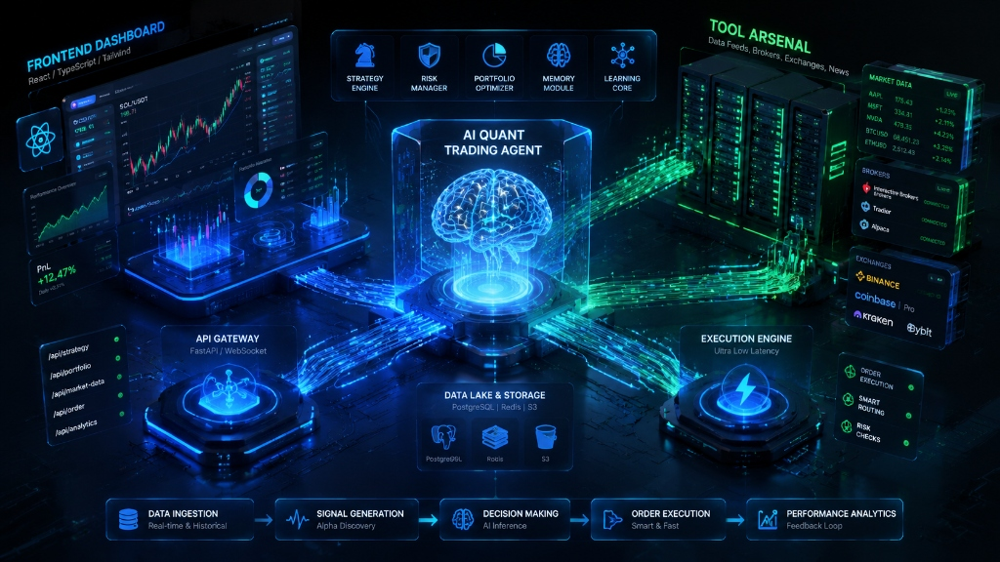
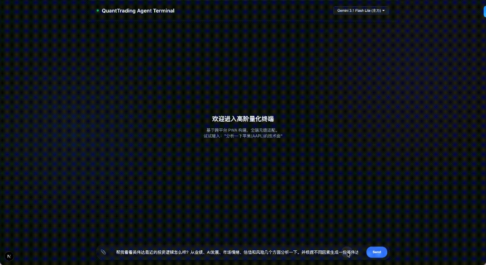

<div align="center">
  
# 🚀 QuantTrading Agent Terminal

一个基于 Python 和 React 构建的开源全栈量化交易 AI Agent 平台。

[](https://fastapi.tiangolo.com/)
[](https://nextjs.org/)
[](https://reactjs.org/)
[](https://www.python.org/)
[](https://deepmind.google/technologies/gemini/)

[English](README.md) | [中文](README_zh.md)

</div>

<br/>

本项目展示了一个专为量化金融打造的生产级 AI Agent 架构。它抛弃了诸如 LangChain 这样臃肿的黑盒框架，选择从底层实现 **原生定制的 ReAct (Reason + Act) 循环引擎**、**多模态图表视觉分析**，以及 **动态模型热切换路由**。

无论你是要对 AAPL 执行深度的基本面拆解，还是依赖技术指标 (MACD/RSI) 评估短线市场情绪，QuantTrading Agent 都能游刃有余地处理，并实时将它的“思维链 (Chain of Thought)”完全透明地展示给你。

## 🏗 系统架构

系统采用高度解耦的双节点架构，专为超低延迟的流式传输和安全的物理工具调度而设计。

<div align="center">
  
</div>

### 🧩 核心大脑 (ReAct Engine)
- **Agent 中枢 (Brain)**: 中央交响乐团指挥。它管理对话历史，维护长短期上下文，并动态决策是调用外部兵器库还是直接输出最终结论。
- **规划器 (Planner)**: 当 Brain 接收到一个复杂的金融目标时，Planner 会将其降维拆解为可执行的、按顺序排列的任务步骤。
- **审核员 (Reflector)**: 极为严苛的质量保证节点。它负责对生成的草稿报告进行量化标准审核，强制要求输出 0-100 的确切交易打分，拒绝任何模棱两可的“可能”建议。
- **调度中心 (Tool Router)**: 安全地分发并执行物理兵器（通过 `yfinance` 拉取市场数据、执行本地文件 I/O，甚至终端 Bash 脚本）。

## ✨ 核心特性与技术栈

<details open>
<summary><b>1. ⚡ 现代化的流式交互 UI (SSE + Next.js)</b></summary>
基于 Server-Sent Events (SSE) 协议，Next.js 客户端能够毫秒级实时渲染 AI 的内部思考过程与工具执行日志。我们实现了交互式的“思维链” (CoT) UI——通过精美的折叠面板，清晰可视化 Agent 最终输出金融报告前的每一滴逻辑推演。
</details>

<details open>
<summary><b>2. 👁️ 多模态视觉解析引擎</b></summary>
直接在终端内粘贴 (Ctrl+V) 或上传 K 线图、财报截图或是热力图。Agent 能够动态处理 Base64 图像流，将视觉形态分析与纯文本逻辑推演完美融合。并搭载了从零手写的全屏图片放大沉浸预览 (Lightbox) 交互。
</details>

<details open>
<summary><b>3. 🔄 动态多模型热切换</b></summary>
平台支持在一次会话中随时在 Gemini 3.5 Pro、Flash 和 Lite 模型间无缝热切换。使用极速的 Lite 模型处理简单查询，遇到深度的基本面剖析时，瞬间切回 Pro 模型。
</details>

<details open>
<summary><b>4. 🛠 即插即用的量化兵器库</b></summary>
后端的工具 Schema 设计高度解耦。当前已内置基于 `yfinance` 的实时股票价格获取、技术指标计算脚本 (MA, RSI)，以及基本面数据拉取器。
</details>


## 🎥 快速演示

感受高质感的毛玻璃 UI (Glassmorphism)、实时逻辑推演以及多模态视觉的魅力：

<div align="center">
  
</div>


## 🚀 快速开始

### 1. 启动后端 (FastAPI)
进入后端目录，配置你的 API Key，然后启动高性能的 ASGI 服务器：

```bash
cd agent_backend

# 1. 使用 uv (或 pip) 安装依赖
uv venv
source .venv/bin/activate
uv pip install fastapi uvicorn requests yfinance

# 2. 配置你的 Gemini API Key
echo "GEMINI_API_KEY=你的_api_key_放在这里" > .env

# 3. 启动服务器
uv run --with fastapi --with uvicorn --with requests --with yfinance main.py
```
*后端服务将运行在 `http://127.0.0.1:8000`。*

### 2. 启动前端 (React/Next.js)
打开一个新的终端窗口，进入前端目录，启动开发服务器：

```bash
cd agent_frontend

# 1. 安装前端依赖
npm install

# 2. 启动客户端
npm run dev
```
*前端界面将运行在 `http://localhost:3000`。*


## 🛣 演进路线图

- [x] **Agent 核心引擎**: 原生定制 Planner、Brain 和 Reflector 模块
- [x] **流式交互 UI**: 基于 SSE 的可折叠思维链 (CoT) 可视化实现
- [x] **金融兵器库**: 基础的基本面和技术面数据获取工具
- [x] **多模态能力**: 终端图片上传、粘贴与 Lightbox 沉浸解析
- [ ] **长期记忆 (Memory)**: 接入向量数据库，构建用户的专属风险画像
- [ ] **多智能体协同 (Multi-Agent)**: 拆分宏观 (Macro)、技术 (Tech) 和风控 (Risk) 专用的子 Agent
- [ ] **自动化回测框架**: 将策略输出直接无缝接入 Backtrader 回测引擎


## 🤝 参与贡献

欢迎！这是一个旨在展示量化金融领域最纯粹的 AI Agent 设计模式的基础开源项目。如果你对 AI、大模型或量化交易感兴趣，欢迎随时提交 Issue、发起 PR 或与我们联系探讨！

---
<div align="center">
  <i>Built with ❤️ to explore the boundaries of AI in Financial Engineering.</i>
</div>
